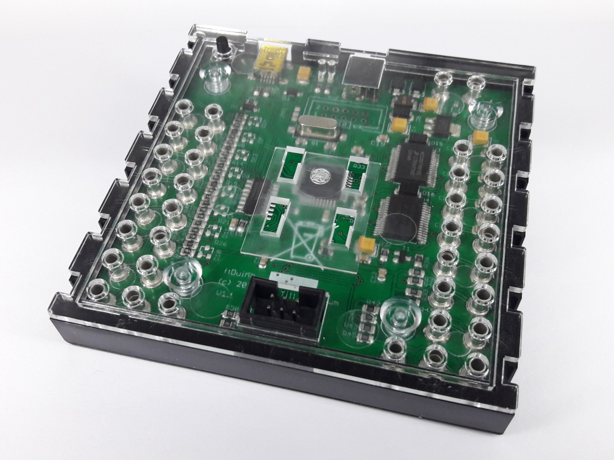

# ftDuino

The ftDuino is an [arduino](http://arduino.cc) compatible controller for the
[fischertechnik construction toy](http://fischertechnik.de).

The ftDuino is similar to the fischertechnik TXT in size and shape as
well as electrically and can usually be used as a drop-in-replacement
to this controller.

The ftDuino combines the sophisticated mechanics of the fischertechnik
toy with the versatility of the arduino world allowing anyone to create
and program awsome machines.

## Features of the ftDuino

   - 8 universal analog inputs I1 to I8
   - 4 fast counter inputs C1 to C4
   - 8 analog outputs O1 to O8 which can be combined as motor outputs M1 to M4
   - I²C connector like the fischertechnik TX controller  
   - compatible to standard fischertechnik 9V power supply
   - compatible with Arduino Leonardo

## Videos

See the ftDuino in action on [youtube](https://www.youtube.com/playlist?list=PLi6a2BPpYcCTMfehFcKaVUSZGubVMpxHx).

## About this repository

This repository contains support files to enable ftDuino support in
the Arduino IDE.

## Installation

You can easily add custom board support packages to the Arduino IDE
as described [here](https://learn.adafruit.com/add-boards-arduino-v164/overview).

Follow this instruction but use the [https://raw.githubusercontent.com/harbaum/ftduino/master/package_ftduino_index.json](https://raw.githubusercontent.com/harbaum/ftduino/master/package_ftduino_index.json) file instead. Afterwards the ftDuino board will show up in board manager from which it can easily be installed.

Once you've done that the ftDuino board shows up in the IDE and can be selected as the board to use.
