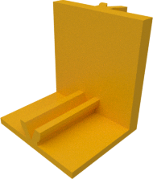
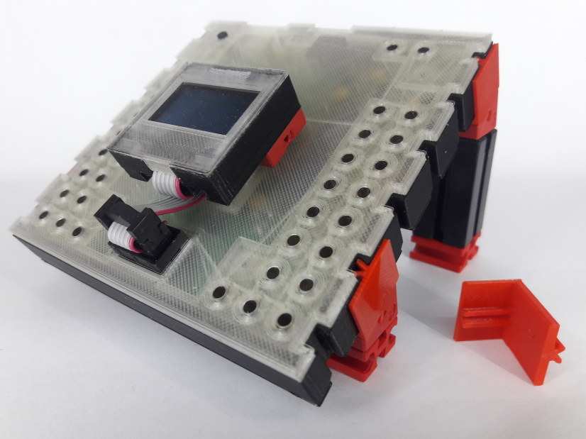

# Edge connector

The ftDuino case unfortunately does not have ft mounts at
its bottom. This is due to the fact that this would make
moulding much more expensive.

|  |
|:---:|
| [View `edge.stl`](edge.stl) |
| [Download `edge.stl`](edge.stl?raw=true) |

The edge connector was therefore built to allow to get some
sore of bottom connectivity as depicted below.

