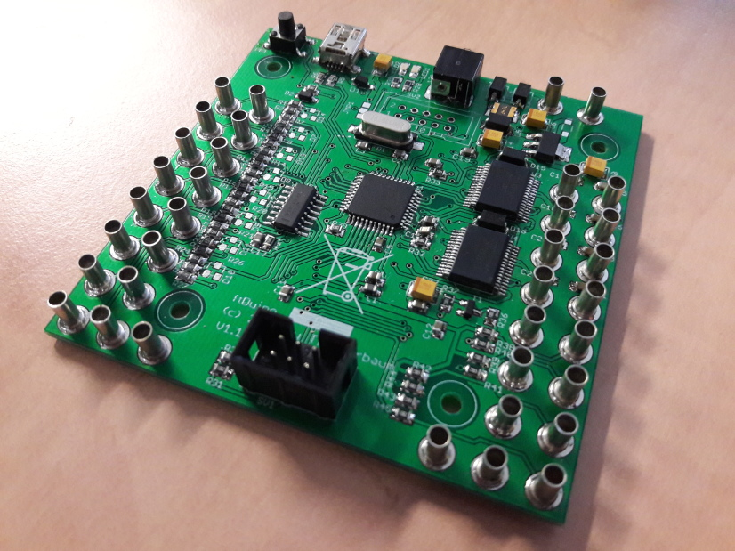

# I²C expander

The I²C expander expands the single 5V I²C port of a ftDuino or
fischertechnik TX controller by three more ports and contains a level
shifter to bridge to a fischertechnik TXT compatible 3.3V port.


This adapter can e.g. be used to connect the ```fischertechnik 
Kombisensor 158402 3-in-1 Orientierungssensor``` ([PDF](https://content.ugfischer.com/cbfiles/fischer/Zulassungen/ft/158402-Kombisensor-Kurzanleitung-BMX055-2017-06-09.pdf)) which is meant to be connected to the TXT and its 3.3V
I²C:


This is how the setup looks right before assembly:



## Parts

All parts are available from e.g. [Reichelt](http://www.reichelt.de).

You need:

  - 1x 10 pin header [WSL 10G](https://www.reichelt.de/Pfosten-Wannenstecker/WSL-10G/3/index.html?ACTION=3&GROUPID=7437&ARTICLE=22816&SEARCH=wannenstecker&START=0&OFFSET=16&)
  - 4x 6 pin header [WSL 6G](https://www.reichelt.de/Pfosten-Wannenstecker/WSL-6G/3/index.html?ACTION=3&GROUPID=7437&ARTICLE=85732&SEARCH=wannenstecker&START=0&OFFSET=16&)
  - 2x resistors [22k ohms SMD](https://www.reichelt.de/SMD-0805-von-1-bis-910-kOhm/SMD-0805-22-0K/3/index.html?ACTION=3&GROUPID=7971&ARTICLE=32902&SEARCH=0805%2B22%252C0k&START=0&OFFSET=16&)
  - 2x N channel MOSFET [BSS 123](https://www.reichelt.de/BS-Transistoren/BSS-123-SMD/3/index.html?ACTION=3&GROUPID=2884&ARTICLE=41435&SEARCH=BSS123&START=0&OFFSET=16&)
  - 1x power regulator [TPS 77033 DBVT](https://www.reichelt.de/ICs-TLC-TSA-/TPS-77033-DBVT/3/index.html?ACTION=3&GROUPID=5480&ARTICLE=188754&SEARCH=77033&START=0&OFFSET=16&)