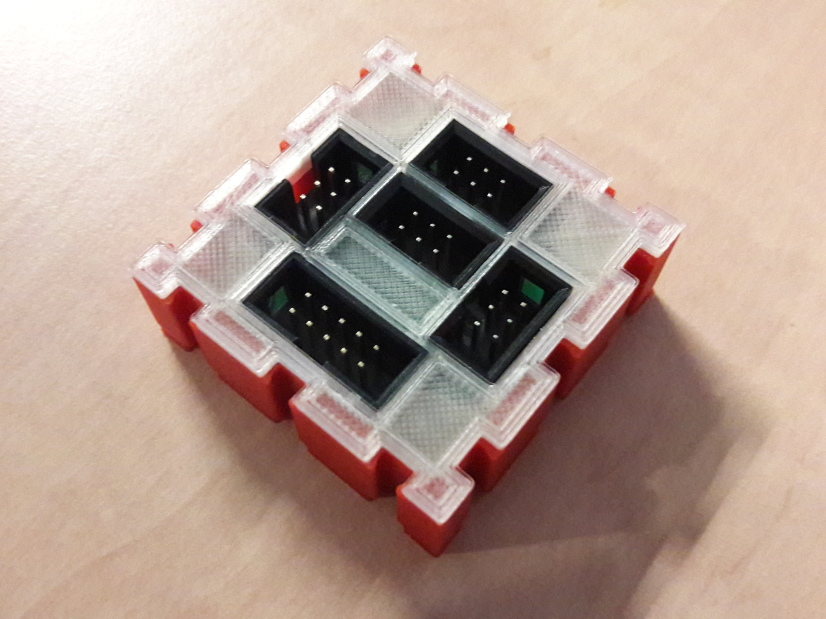
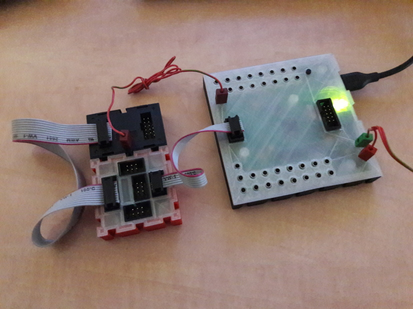

# I²C expander

The I²C expander expands the single 5V I²C port of a ftDuino or
fischertechnik TX controller by three more ports and contains a level
shifter to bridge to a fischertechnik TXT compatible 3.3V port.



This adapter can e.g. be used to connect the ```fischertechnik 
Kombisensor 158402 3-in-1 Orientierungssensor``` ([PDF](https://content.ugfischer.com/cbfiles/fischer/Zulassungen/ft/158402-Kombisensor-Kurzanleitung-BMX055-2017-06-09.pdf)) which is meant to be connected to the TXT and its 3.3V
I²C:


