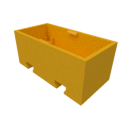
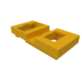
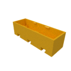

# Mini I²C servo controller

The 30mm version featuring a single I²C port:

|  |  |
|:---:|:---:|
| [`bottom30.stl`](case/bottom30.stl) | [`top30.stl`](case/top30.stl) |

The 45mm version featuring two I²C ports:

|  |  |
|:---:|:---:|
| [`bottom45.stl`](case/bottom45.stl) | [`top45.stl`](case/top45.stl) |

# I²C-Registers

By default the adapter uses I²C address 0x11 (dec 17).

| Register | Description |
| 0x00/0x01 | Set servo pulse width of output 1 or 2 in 16us steps. E.g. 63 is 1ms (typical min value of a servo) and 125 is 2ms (typical max value of a servo). By default the adapter will not allow values < 53 and values > 125 to protect the servo. Example set PWM1 to 1.5ms: 0x11 0x00 0x5e |
| 0x02/0x03 | Set lower limit for servo 1 or servo 2 in 16us steps. Default value is 63. Values written to registers  0x00/0x01 lower than the limits specified here are mapped to this limit. |
| 0x04/0x05 | Set upper limit for servo 1 or servo 2 in 16us steps. Default value is 125. Values written to registers  0x00/0x01 higher than the limits specified here are mapped to this limit. |
| 0x06/0x07 | Set offset for servo 1 or servo 2. Default value is 0. The offset is added to the PWM value written to registers 0 or 1 _after_ the limit takes place. This is useful to adjust the center position of a servo. |
| 0x08 | Set I²C address. The new address can be any address >= 0x03 and <= 0x77 except 0x3c (which is reserved because the OLED uses it). |
| 0x09 | Writing 0xa5 to this register stores the values from registers 0x02 to 0x08 in eeprom. These settings will then become permanent over power loss and reboot. |
| Read 0x00 | Reading register 0x00 returns the formware version in BCD, e.g. 0x10 for version 1.0 |
| Read 0x01+ | Reading any other register returns 0x5a |
