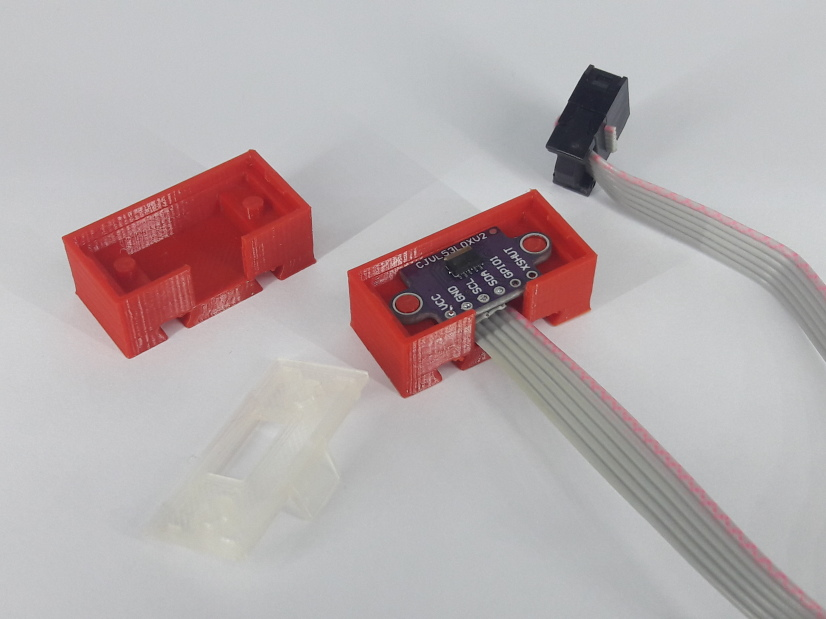
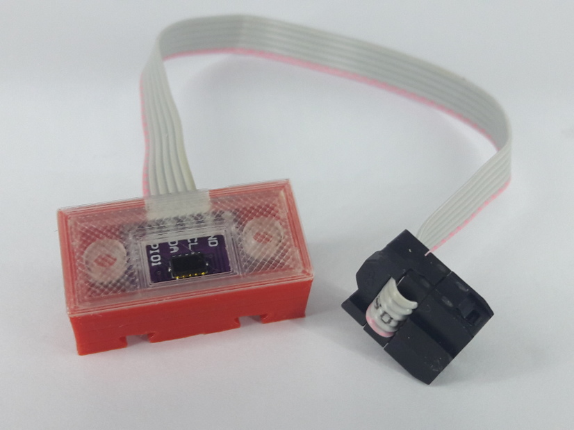

# ftDuino - vl53l0x addon

The vl53l0x is a time of flight (ToF) distance sensor. It can e.g. be
used as a replacement for the fischertechnik ultrasonic distance
sensor.

A matching arduino library can e.g. found in the [Adafruit repository](https://github.com/adafruit/Adafruit_VL53L0X).

