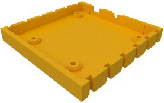
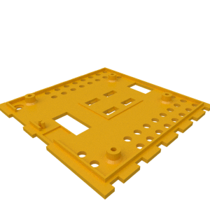
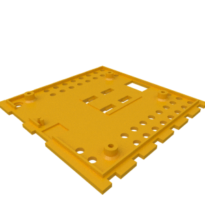
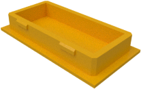
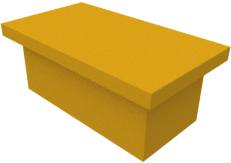
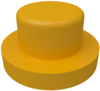

# ftDuino case designs

These are mesh files for the ftDuino 1.1 case. At least `bottom.stl` and
one of `top_with_isp.stl` or `top_without_isp.stl` are needed.

|  |  |  |
| --- | --- | --- |
| `bottom.stl` | `top_with_isp.stl` | `top_without_isp.stl` |

The `top_with_isp.stl` is to be used if the ISP connector is to
be mounted. The `top_without_isp.stl` is for boards without ISP
connector. The ISP connector hole in `top_with_isp.stl` can alternally
be closed with the `isp_cap.stl`.

|  |
| --- |
| `isp_cap.stl` |

The `i2c_protector.stl` is a small piece that fits into the 6 pin
I²C connector if it's not in use and prevents it from accidentially
being shortened or otherwise damaged.

|  |
| --- |
| `i2c_protector.stl` |

The `reset_button.stl` reset button is required if a 4.3mm tactile
switch is used as a reset button. It's not needed if a 7 or 9mm
version is used.

|  |
| --- |
| `reset_button.stl` |
